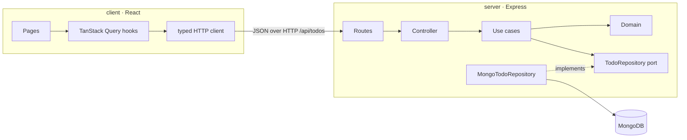

# Todos

A full-stack TODO app: a React + TypeScript client and an Express + TypeScript API backed by MongoDB, in one npm-workspaces monorepo.

You can view your todos, add one with a title and optional description, edit it, mark it done or not done, and delete it. Completed todos are crossed out with an ink line.

| App | What it is | Docs |
|---|---|---|
| [`client/`](client/README.md) | React 19, Vite, React Router, TanStack Query, Tailwind CSS | [Client README](client/README.md) |
| [`server/`](server/README.md) | Express 5, Mongoose, Zod, layered (DDD-style) architecture | [Server README](server/README.md) |

## Quick start

**Prerequisites:** Node.js 22.22 or newer, npm, and either Docker (for a local MongoDB) or a MongoDB Atlas connection string.

```bash
# 1. Install dependencies for both apps (run from the repo root)
npm install

# 2. Start MongoDB locally (skip if you use Atlas)
docker compose up -d

# 3. Configure the server
cp server/.env.example server/.env
#    Using Atlas? Put your connection string in MONGODB_URI in server/.env

# 4. Start the API and the client together
npm run dev
```

Then open **http://localhost:5173**. The API runs on http://localhost:4000, and the client's dev server forwards `/api` requests to it.

Run every `npm` command from the repo root. Commands for one app use the `-w` flag, for example `npm test -w server`.

## Scripts (repo root)

| Command | What it does |
|---|---|
| `npm run dev` | Starts the API and the client together |
| `npm run dev:server` | Starts only the API |
| `npm run build` | Builds both apps |
| `npm run typecheck` | Type-checks both apps |
| `npm test` | Runs the tests of both apps |
| `npm run lint` / `npm run lint:fix` | Lints the whole repo (one shared ESLint config) |
| `npm run format` / `npm run format:check` | Formats with Prettier |

## Repository layout

```
.
├── client/               React app (see client/README.md)
├── server/               Express API (see server/README.md)
├── docker-compose.yml    Local MongoDB
├── eslint.config.ts      One lint config for both apps
├── tsconfig.base.json    Strict TypeScript settings shared by both apps
├── .prettierrc
└── package.json          npm workspaces + root scripts
```

## How the pieces fit



## Why a monorepo

Both apps live in one repository managed with **npm workspaces**, so a reviewer runs one `npm install` and one `npm run dev`. The two apps share a strict `tsconfig.base.json`, one ESLint config, and one Prettier config, so code style and compiler rules can't drift between them. npm workspaces needs no extra tooling; at this size, Nx or Turborepo would add setup without adding value.

## Beyond the brief

These were added deliberately and keep the required API contract intact:

- **`GET /api/todos/:id`**, so the edit page works when opened from a link or refreshed.
- **Optional pagination** on `GET /api/todos` (`?page=&limit=`). Without parameters it still returns every todo as a plain array, exactly as specified. Page counts travel in response headers.
- **Optimistic updates** for toggling and deleting, with toast notifications and automatic rollback when the server fails.

Each app's README lists its assumptions and limitations.